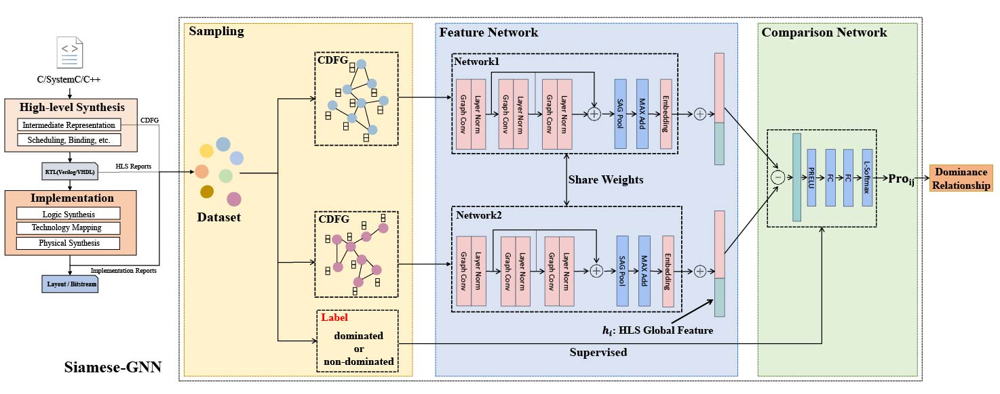

# Learning by Comparing: Siamese-GNN for Design Space Exploration in High-Level Synthesis
## Table of Contents
  - [About the project](#jump1)
  - [Directory Structure](#jump2)
  - [Required environment](#jump3)

## <span id="jump1">About the project</span>
The project aims to constrcut a Siamese-GNN, which consists of a feature network and a comparison network, to identify Pareto-optimal designs by inferring the dominance relationships among designs using a classification method.

### Contribution
- We propose to address the HLS DSE problem from a
coarse-grained classification perspective instead of using fine-grained regression methods.
- We introduce a Siamese-GNN consisting of a feature network and a comparison network, which takes design pairs as input to identify their dominance relationships without predicting their specific metrics.
- Experimental results across several benchmarks demonstrate that the proposed Siamese-GNN achieves high accuracy in inferring dominance relationships and outperforms state-of-the-art regression-based predictors in terms of ADRS results.

## <span id="jump2">Directory Structure</span>
```
|-- Transformer
|   |-- hgp
|   |   |-- Contrastive_Architecture.py       #define the architecture of the Siamese-GNN                            
|   |   |-- Contrastive_Model.py              #train and test the Siamese-GNN
|   |   |-- DSE.py                            #design space exploration by using different preditors
|   |   |-- DSE_ds                            #the testing dataset used for DSE
|   |   |   |-- rdc
|   |   |   |   |-- bfs.pt
|   |   |   |   |-- fft.pt
|   |   |   |   |-- md.pt
|   |   |   |   |-- stencil.pt
|   |   |   |   `-- viterbi.pt
|   |   |   `-- std
|   |   |       |-- bfs.pt
|   |   |       |-- fft.pt
|   |   |       |-- md.pt
|   |   |       |-- stencil.pt
|   |   |       `-- viterbi.pt
|   |   |-- Hier.py                           #run HGP+SAGE+GF
|   |   |-- Iron.py                           #run Ironman-Pro
|   |   |-- Siamese GNN.py                    #run Siamese-GNN 
|   |   |-- dataset_utils.py          
|   |   |-- datasets.py     
|   |   |-- extension                         #record the Siamese-GNN's input size and the inference time     
|   |   |   |-- extension.svg
|   |   |   |-- inference_time_dse0.npy       
|   |   |   |-- inference_time_dse1.npy
|   |   |   |-- inference_time_dse2.npy
|   |   |   |-- inference_time_dse3.npy
|   |   |   |-- inference_time_dse4.npy
|   |   |   |-- nodes_size_dse0.npy
|   |   |   |-- nodes_size_dse1.npy
|   |   |   |-- nodes_size_dse2.npy
|   |   |   |-- nodes_size_dse3.npy
|   |   |   `-- nodes_size_dse4.npy
|   |   |-- extension.py                      #Scalability Experiments
|   |   |-- hier                              #5-fold cross-validation model results of HGP+GF+SAGE
|   |   |   |-- 1
|   |   |   |   |-- hier_bram_test.pt
|   |   |   |   |-- hier_cp_test.pt
|   |   |   |   |-- hier_dsp_test.pt
|   |   |   |   |-- hier_ff_test.pt
|   |   |   |   |-- hier_lut_test.pt
|   |   |   |   `-- hier_pwr_test.pt
|   |   |   |-- 2
|   |   |   |-- 3
|   |   |   |-- 4
|   |   |   `-- 5
|   |   |-- hier_models                        #define the model architecture of HGP+GF+SAGE
|   |   |   |-- HierNet.py
|   |   |   |-- hier_bram_model.py
|   |   |   |-- hier_cp_model.py
|   |   |   |-- hier_dsp_model.py
|   |   |   |-- hier_ff_model.py
|   |   |   |-- hier_lut_model.py
|   |   |   `-- hier_pwr_model.py
|   |   |-- iron                                #5-fold cross-validation results of Ironman-Pro model
|   |   |   |-- 1
|   |   |   |   |-- iron_bram_test.pt
|   |   |   |   |-- iron_cp_test.pt
|   |   |   |   |-- iron_dsp_test.pt
|   |   |   |   |-- iron_ff_test.pt
|   |   |   |   |-- iron_lut_test.pt
|   |   |   |   `-- iron_pwr_test.pt
|   |   |   |-- 2
|   |   |   |-- 3
|   |   |   |-- 4
|   |   |   `-- 5
|   |   |-- ironman_pro                          #define the model architecure of Ironman-Pro
|   |   |   |-- dataset_utils.py
|   |   |   |-- graph_model_bram.py
|   |   |   |-- graph_model_cp.py
|   |   |   |-- graph_model_dsp.py
|   |   |   |-- graph_model_ff.py
|   |   |   |-- graph_model_lut.py
|   |   |   |-- graph_model_pwr.py
|   |   |   `-- pred_objs.py
|   |   |-- k_result                             #accuracy result 5-fold cross-validation
|   |   |   |-- hier.npy
|   |   |   `-- iron.npy
|   |   |-- lsoftmax.py                          #Large-Margin (L-Softmax) Loss
|   |   |-- runDSE.py                           
|   |   |-- siamese_gnn                          #5-fold cross-validation results of Siamese-GNN
|   |   |   |-- 1
|   |   |   |   |-- cls_test.pt
|   |   |   |   `-- cls_train.pt
|   |   |   |-- 2
|   |   |   |-- 3
|   |   |   |-- 4
|   |   |   |-- 5
|   |   |   `-- train_data.npy                   #accuracy result 5-fold cross-validation
|   |   `-- train_ds                             #training dataset
|   |       |-- rdc
|   |       |   |-- aes.pt
|   |       |   |-- gemm.pt
|   |       |   |-- nw.pt
|   |       |   |-- sort.pt
|   |       |   `-- spmv.pt
|   |       `-- std
|   |           |-- aes.pt
|   |           |-- gemm.pt
|   |           |-- nw.pt
|   |           |-- sort.pt
|   |           `-- spmv.pt
```
notes: DSE_ds.rar, train_ds.rar is the data zip file and should be extracted to the hgp folder as shown in the directory structure above. 
## <span id="jump3">Required environment</span>

- os                        win64
- torch-geometric           2.5.3
- seaborn                   0.13.2 
- pytorch                   1.13.1-py3.9_cuda11.7_cudnn8_0
- torch-cluster             1.6.1+pt113cu117 
- torch-scatter             2.1.1+pt113cu117
- torch-sparse              0.6.17+pt113cu117
- torch-spline-conv         1.2.2+pt113cu117
- scikit-learn              1.5.0
- python                    3.9.19
- pandas                    2.2.2
- numpy                     1.26.4
